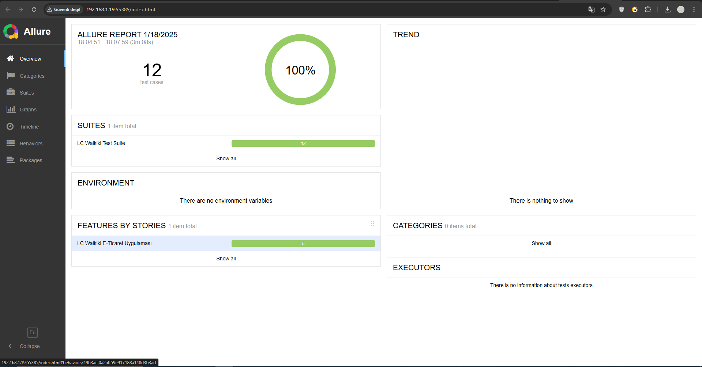
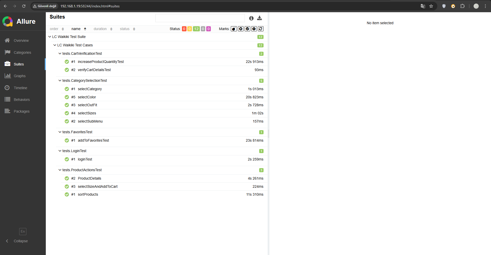
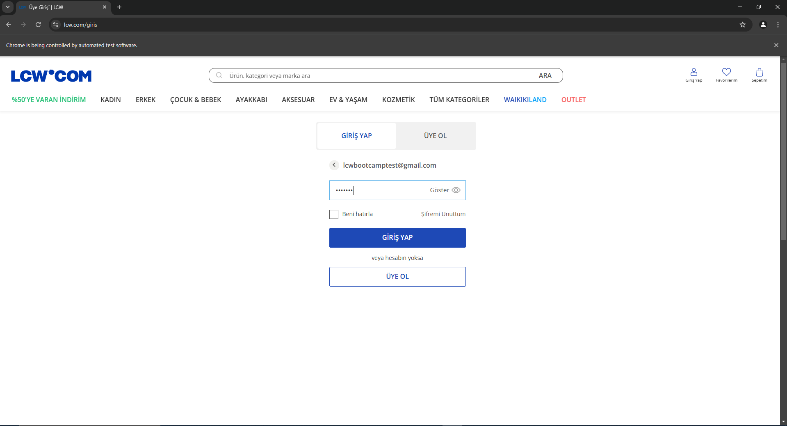
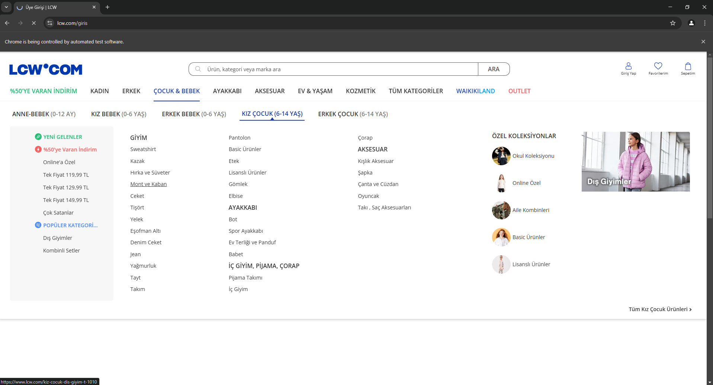
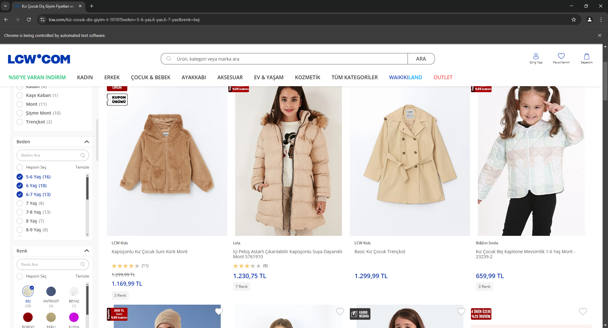
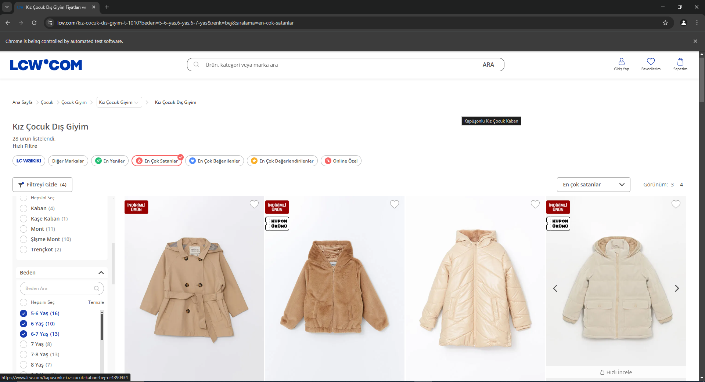
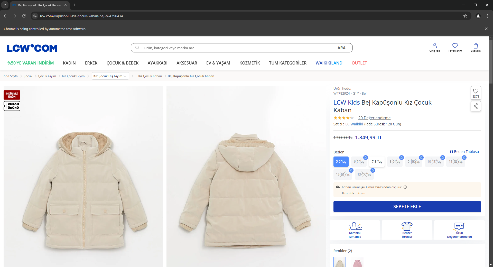
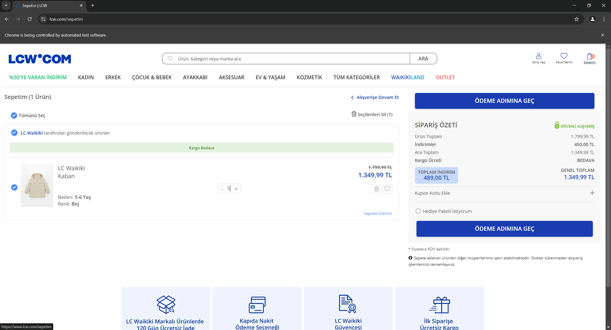
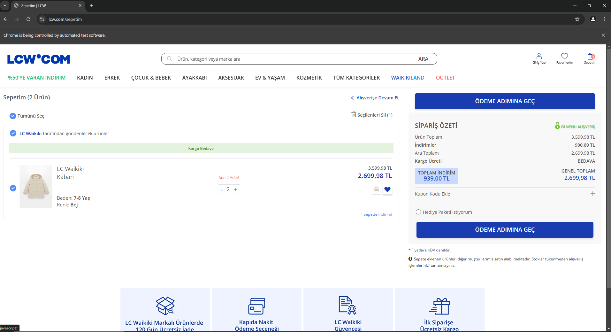
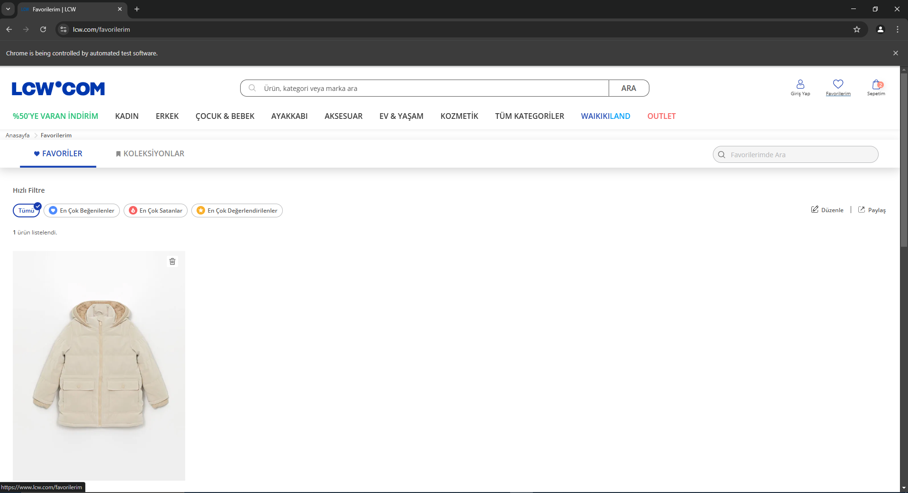

# LC Waikiki Final Project

## Genel Bakış
Bu proje, LC Waikiki e-ticaret platformu için geliştirilmiş kapsamlı bir test otomasyon sistemi sunmaktadır. Sistem, giriş yapma, kategori gezinme, ürün seçimi, sepet işlemleri ve doğrulama gibi temel işlevleri otomatikleştirmek için tasarlanmıştır.

## Teknolojiler ve Araçlar
- **Programlama Dili**: Java
- **Proje Yönetim Aracı**: Maven
- **Test Framework**: TestNG
- **Web Test Otomasyonu**: Selenium WebDriver
- **Raporlama**: Allure Reports, Log4j

## Test Senaryoları
1. **Giriş Testi**

- LC Waikiki ana sayfasına gidilir.
- Geçerli bir e-posta ve şifre girilir.
  
2. **Kategori Seçim Testi**

- "Çocuk & Bebek" kategorisini seçilir.
- "Kız Çocuk (6-14 yaş)" sekmesine gidilir ve "Mont ve Kaban" seçeneği seçilir.
- Ürünler, beden ve renk ile filtrelenir.

3. **Ürün Testi**

- Ürünler, "En çok satanlar" olacak şekilde sıralanır.
- Stokta olan bedenlerden rastgele bir beden seçilir.
- Ürün sepete eklenir.

4. **Sepet Testi**

- Sepetim sayfasina gidilir.
- Ürün miktarı stok durumuna göre artırılır. 
- Sepetteki ürünün detayları doğrulanır.

5. **Favoriler Testi**

- Favorilerim ekranına gidilir.
- Favorilere eklenen ürünün listede olduğu kontrol edilir.	

Test detaylarını görmek için [buraya tıklayın](.LCWTestCase.pdf).

## Allure Report Sonuçları

## Proje Ekran Görüntüleri

### 1. Login Testi

### 2. Kategori Seçimi Testi

### 3. Filtre Seçimi Testi

### 4. Sıralama Testi

### 5. Ürün Seçim Testi

### 6. Sepete Ekleme ve Doğrulama Testi

### 7. Favorilere Ekleme Testi

### 8. Favoriler Doğrulama Testi

### Author
- **Derya Aysu Kılıç**

